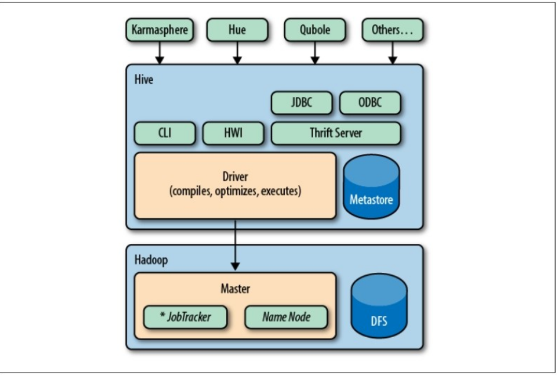
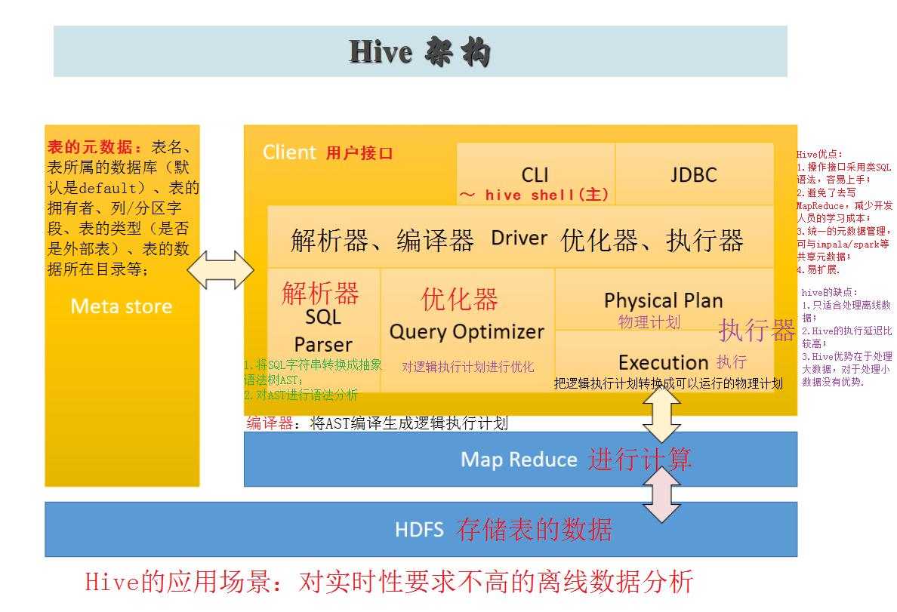

* content
{:toc}
Hive组件概述，Hive是什么，Hive能做什么。

#  Hive概述
Hive是基于Hadoop的数据仓库解决方案。由于Hadoop本身在数据存储和计算方面有很好的可扩展性和高容错性，因此使用Hive构建的数据仓库也秉承了这些特性。
这是来自官方的解释。

简单来说，Hive就是在Hadoop上架了一层SQL接口，可以将SQL翻译成MapReduce去Hadoop上执行，这样就使得数据开发和分析人员很方便的使用SQL来完成海量数据的统计和分析，而不必使用编程语言开发MapReduce那么麻烦。

先上一张经典的Hive架构图：

Hive发行版中附带的模块有:

CLI Hive命令行接口

HWI 简单网页界面

JDBC、ODBC

Thrift

Hive的执行流程：

所有的命令和查询都会进入到Driver(驱动模块),通过该模块对输入进行解析编译,对需求计算进行优化,然后按指定步骤执行(通常是启动多个MapReduce任务)。当需要启动MapReduce任务时,Hive自身不会生成Java MapReduce算法程序。而是使用一个表示"job执行计划"的XML文件驱动执行内置的、原生的Mapper和Reducer模块。通俗讲,该驱动的"语言"是以XML形式编码的。

Hive使用jobtrack通信来初始化MapReduce任务。不必部署在jobtrack所在的管理节点上。

Metastore(元数据存储)是一个独立的关系型数据库(通常是一个MySQL实例),Hive在其中保存表模式和其他系统元数据。

## 优点与使用场景
1.操作接口采用类SQL语法，操作简单容易上手。  
2.避免了去写MapReduce，减少开发人员的学习成本。  
3.统一的元数据管理，可与impala/spark等共享元数据。  
4.易扩展(HDFS+MapReduce：可以扩展集群规模；支持自定义函数)。  
5.数据的离线处理；比如：日志分析，海量结构化数据离线分析…  
  Hive的执行延迟比较高，因此hive常用于数据分析的，对实时性要求不高的场合  
  Hive优势在于处理大数据，对于处理小数据没有优势，因为Hive的执行延迟比较高。

